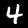
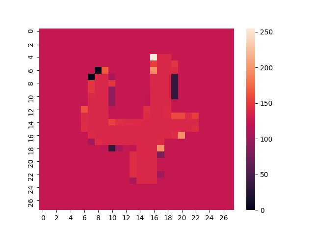

# LIME-MNIST
This repository contains a simplistic implementation of LIME model interpretability method on a small CNN.
However the same procedure can be reduced with any other dataset and any other model.

# Local Interpretable Model-Agnostic Explanations (LIME)
LIME explains the predictions of a model at a data point by fitting a locally weighted linear regression at that data point.
In this implementation, we have used the class score of the predicted class as per our CNN as Y and the MNIST image as X.
If we want to find the interpretation for a point `X_h`(say), then we can form the following objective function

where the weights are given by a gaussian kernel at `X_h`:

We find a close form solution to this objective function and use it to find `theta` which is our explanation.

# Example:

On the left is the original image and on the right is the explanation by LIME.

# Original Paper
“Why Should I Trust You?” Explaining the Predictions of Any Classifier, Ribiero et al., KDD 2016
